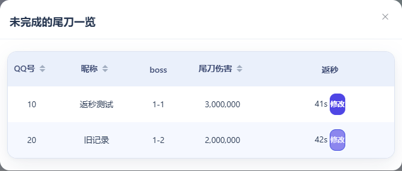
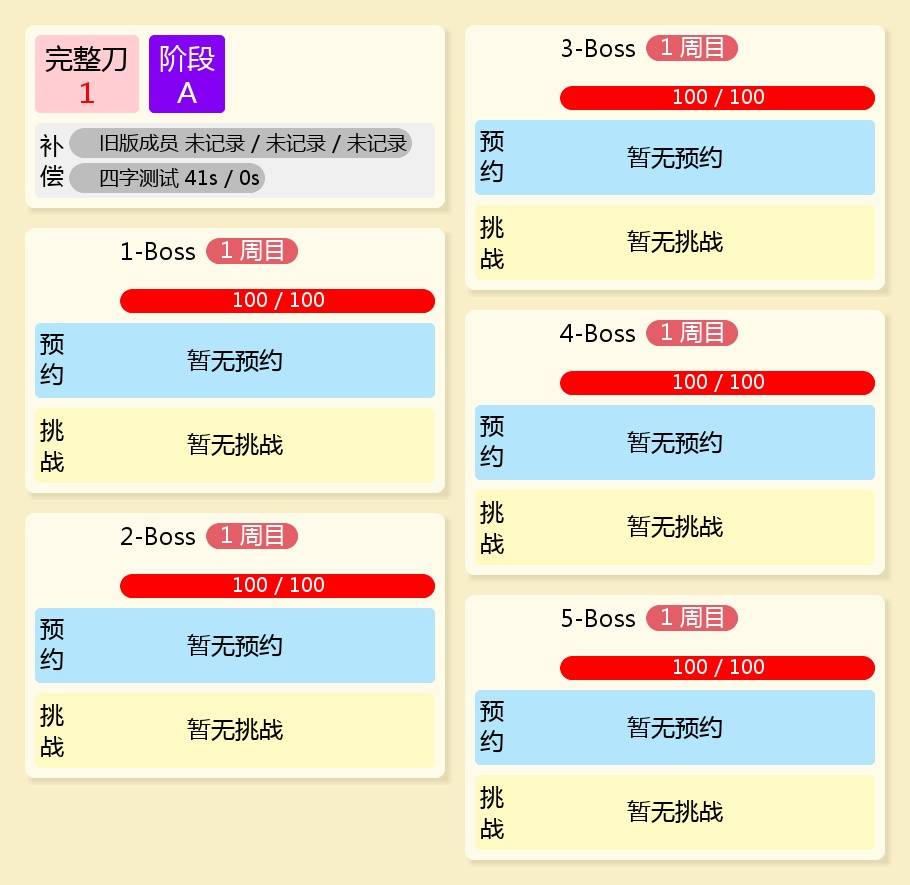
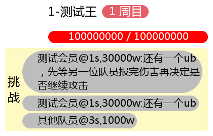

# 报伤害留言与尾刀返秒

先申请出刀，再发送 `报伤害 30000w 还有一个ub`。留言前留空格，无需冒号。代报使用 `报伤害 30000w@成员 还有一个ub`，@ 必须在留言前。留言显示在状态图片的挑战区，长留言自动换行；重新报伤害会覆盖留言，不写留言则清空，取消报伤害也会清空。挂树留言独立保留。报刀成功后取消出刀状态，撤销可恢复原报伤害留言。

尾刀可记录返秒，例如 `尾刀 41s`（已申请出刀）或 `尾刀 1 41s`（指定1王）。返秒支持 `s`、`S`、`秒`，范围21–90，可省略，也可放在其他参数之后：`尾刀 1 b @成员 昨日 41s`。报刀、尾刀均不支持留言。

返秒保存到对应报刀记录，在查刀的尾刀格、详情提示和“尾刀一览”中显示。状态图片的补偿区显示当前公会、档案及会战日尚未消耗的补偿返秒；多个补偿依出刀先后消耗，相同返秒合并为数量，例如“90s ×3”。阶段标签从B开始。B/C阶段未报返秒默认90s，D阶段未报显示“?s”。

尾刀一览的“修改”可补填或修正21–90秒返秒，点击“保存”后查刀和状态图片同步。成员可改自己的未使用补偿，公会管理员和全局管理员可代改。已使用的补偿不再修改；取消编辑不会保存。若他人已修改或补偿已使用，保存会提示刷新后重试。

查刀页操作行最后提供“仅显示未完成”筛选，位于“尾刀一览”之后。开启时只显示未完成三刀的成员，关闭后恢复全部成员；公会总刀数统计仍使用全部成员。尾刀一览使用可伸缩列宽，并覆盖新版主题的默认弹窗宽度；已验证705px、390px和桌面下，返秒编辑无需横向拖动。

数据库自动升级到版本4，新增可空 `return_seconds` 整数字段。升级前备份数据目录；回退旧程序时恢复升级前数据库。报伤害留言存于当前出刀状态的 `damage_message`，不占用挂树留言字段。
