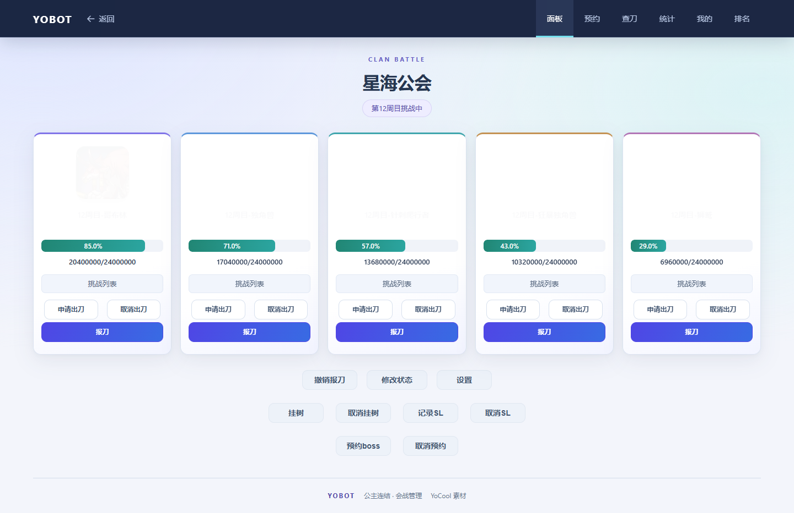
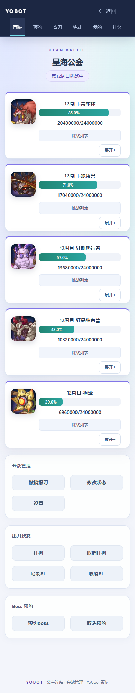
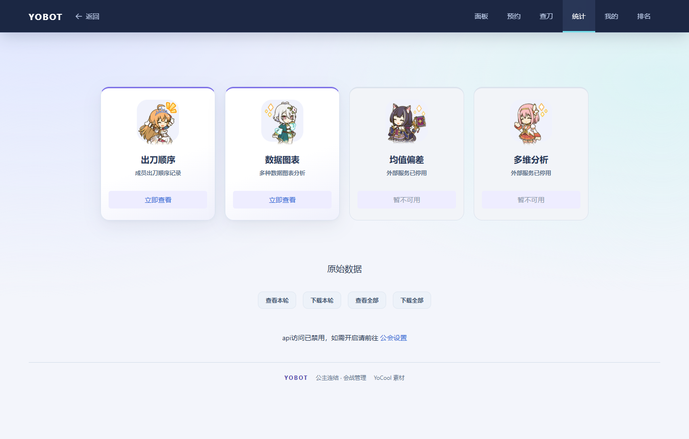
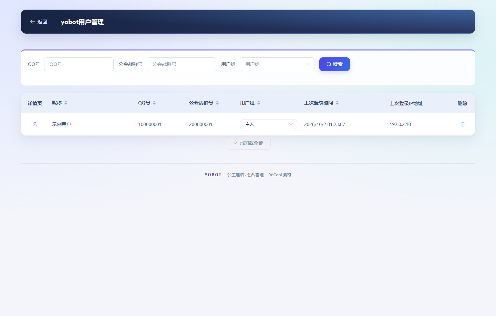
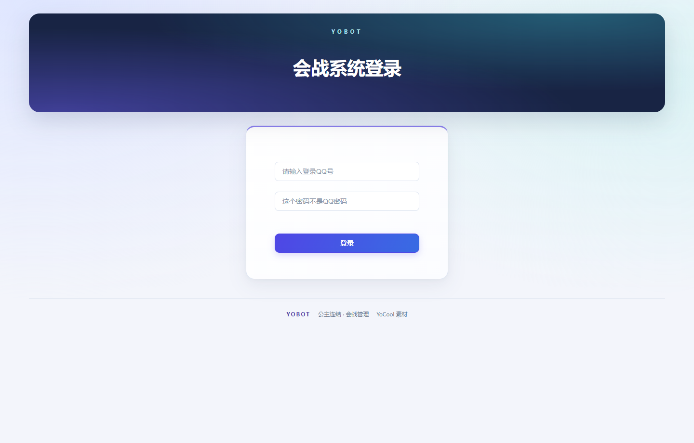

# 前端视觉更新

页面使用深蓝导航、靛蓝主色与青色点缀的统一主题，以渐变标题区、柔和背景光晕、卡片边框和分层阴影加强视觉层次，保留 Boss 和角色素材。会战面板、查刀、预约、统计、设置、登录、账号及后台管理页面共享导航、表格、输入框和弹窗样式。

## 预览

以下截图由真实页面模板和本地依赖在 Edge 中渲染，使用虚构示例账号和公会数据，IP 使用文档示例地址。

## 实现

- `public/static/ui/theme.css` 提供共享样式；`partials/ui_head.html` 使用带内容摘要的资源地址，避免旧缓存。
- 动效包含图片和标题入场、桌面按钮与统计卡片悬停、输入框聚焦反馈和 Boss 血条过渡；系统减少动画偏好会关闭动画与过渡。Boss 卡片容器不使用 transform 或 opacity 动画，确保内嵌弹窗覆盖整个视口。
- 面板底部按会战管理、出刀状态和 Boss 预约分组，桌面使用带标题的横向操作卡片，窄屏使用两列按钮；按钮至少 44px 高，间距 16–18px。
- 手机 Boss 操作展开后独占一行，三个按钮等宽排列；展开收起使用短暂淡入淡出。
- 页面停用 YoCool 的随机主题脚本，素材和旧布局 CSS 仍保留。新的页脚保留项目与素材来源。
- 面板在 767 像素及以下使用移动布局，监听窗口宽度变化；桌面卡片随宽度改为五列或三列。
- 宽表格使用表格内部滚动。Boss 设置表在自身区域横向滚动。移动弹窗标签上下排列，图表上下排列并随窗口变化重新计算大小。
- 样式只作用于 `html.yobot-ui`，保留完成出刀、SL、危险操作和禁用状态的视觉区分，支持键盘焦点和系统减少动画偏好。

## 验证

运行 `python -m unittest discover -s tests -v`。模板测试检查统一主题资源、URL 前缀、移动 viewport、停用随机主题和访客只读入口。

本轮还使用 Playwright 和本机 Edge 检查 1440、768、390 像素宽度，验证面板、设置、查刀、预约、统计入口、统计图表、账号、登录、密码及后台管理页面无整页横向溢出；报刀弹窗可打开，Boss 设置可展开，窗口变化后图表宽度会更新。网络数据使用模拟响应，未连接生产公会提交报刀，未在 iOS Safari 实机验证。

部署试用时重点检查：切换面板导航、手机展开 Boss 操作、申请及报刀弹窗、查刀表内滚动、统计标签切换、后台保存设置。原会战 API 和数据库没有改动。

本次视觉增强使用真实模板与模拟响应，在 Edge 检查面板、统计入口、首页、登录、用户管理、公会管理和出刀顺序的 1440、768、390、360 像素布局；确认页面无横向溢出，手机 Boss 操作展开不挤压，报刀弹窗层级正确，系统减少动画偏好生效。99 项回归测试通过，其中 Windows 无符号链接权限的 1 项跳过。截图使用模拟数据，未向生产公会发起写入。
